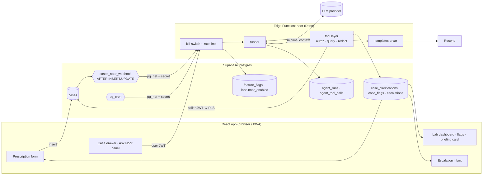
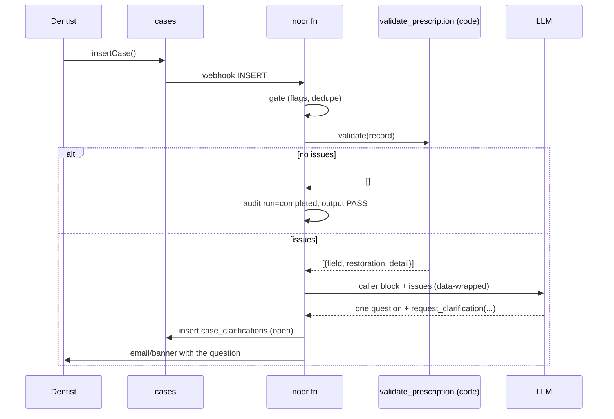
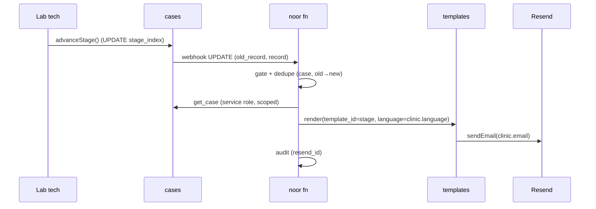
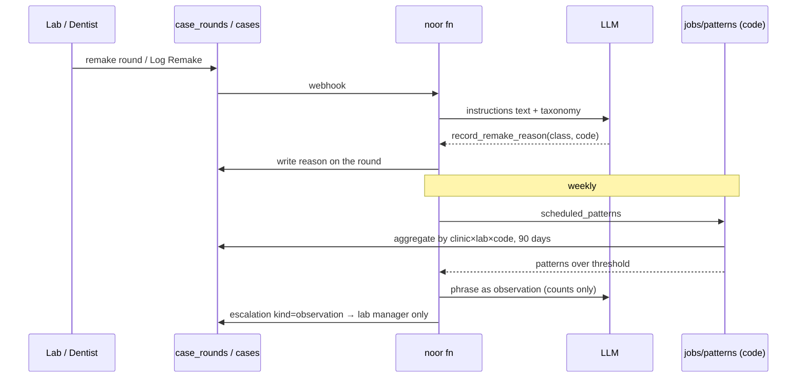
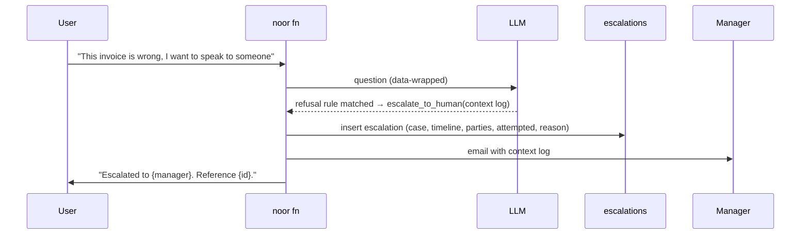

# 02 — Architecture

## Components



One new Edge Function, `noor`. `case-notify` is untouched: a **second** trigger
function on `cases` posts the same `{type, record, old_record}` envelope to
`/functions/v1/noor`, reusing `private.webhook_config.case_notify_secret` (rename
to a shared `webhook_secret` is optional). This mirrors the existing
`notify_invite_webhook` pattern exactly and keeps the two functions independently
deployable and independently killable.

## Triggers and entry points

| Trigger | Source | Auth on entry | Roles |
|---|---|---|---|
| `prescription_submitted` | `cases` INSERT via `cases_noor_webhook` | shared secret | 1 |
| `stage_changed` | `cases` UPDATE where `old_record.stage_index ≠ record.stage_index` | shared secret | 3, 2 (re-check) |
| `remake_recorded` | `cases` UPDATE where `remake` changed, or `case_rounds` INSERT with `kind='remake'` | shared secret | 5 |
| `clarification_answered` | `case_clarifications` UPDATE `answered_at` set | shared secret | 1 (re-validate) |
| `scheduled_watch` | `pg_cron` every 30 min → `private.run_noor('scheduled_watch')` | shared secret | 2, 7 (stale) |
| `scheduled_brief` | `pg_cron` hourly; function sends for labs whose local time is the brief hour, deduped per lab per day | shared secret | 6 |
| `scheduled_patterns` | `pg_cron` weekly (Sunday 03:00 UTC) | shared secret | 5 |
| `user_question` | client `POST /noor` with the user's Supabase JWT | JWT → `auth.getUser()` | 4, 7 |

Every entry passes the **gate** first: global flag → tenant flag → rate limit →
idempotency key (`trigger + case_id + old/new stage` or `trigger + lab_id + date`).
A duplicate delivery (pg_net retries) is a no-op.

## Context assembly

The runner builds the model context per trigger from tool results only, and
wraps every field that originated from a user in `<data>`.

| Trigger | What enters the model context | What never does |
|---|---|---|
| prescription_submitted | case id, stage, the `issues[]` from `validate_prescription`, the offending restoration (category, material, shade guide, teeth), dentist language | patient name/phone/ID, notes beyond the contradicting sentence, file URLs, prices |
| stage_changed | nothing — template path, no model call | — |
| scheduled_watch | nothing unless a flag needs phrasing: then case id, stage, benchmark dates, days over | patient identifiers, prices |
| user_question | the question, caller block, tool results as returned (already RLS-scoped and redacted) | other tenants' rows (impossible at RLS), auth emails, tokens |
| remake_recorded | round instructions text, taxonomy list | cost, prices |
| scheduled_patterns | aggregated counts per (clinic, lab, reason_code, period) | case ids of individual remakes, patient data |
| scheduled_brief | nothing — composed by code, template rendered | — |

**Patient identifiers.** `get_case` returns `patient_ref` = `patient_id` only
(the clinic's own reference) and omits `patient_name` and `patient_phone` unless
the caller is the case's clinic *and* the question explicitly asks for the
patient. Noor's outputs use the case ID.

## Tool layer and the authorisation boundary

```
noor/
  index.ts        entry: gate → route by trigger → runner
  runner.ts       assembles context, calls model, executes tool calls, enforces caps
  tools/*.ts      one file per tool: authz() → query() → redact() → shape()
  authz.ts        assertCanRead(caller, case) / assertCanAct(caller, case)
  templates/      en.ts, ar.ts — status updates, brief, escalation summary
  jobs/           watch.ts, brief.ts, patterns.ts (pure code, no model)
  audit.ts        agent_runs / agent_tool_calls writer with redaction
  _shared/email.ts  sendEmail() lifted out of case-notify (identical behaviour)
```

- **Read tools** create a PostgREST client **with the caller's JWT**. RLS answers
  visibility; a tool cannot return a row the user could not fetch in the app.
- **Write tools** need the service role (flags and escalations must be writable
  regardless of who triggered them). Before any write, `assertCanAct` re-derives
  the tenancy from the database (`cases.lab_id / clinic_id` vs caller's
  `lab_members` / `clinic_members`) — the same logic as the RLS helpers, in code
  the model cannot reach. Scheduled runs have no caller; they iterate labs with
  `noor_enabled` and scope every query by that `lab_id`.
- **The model never sees a tenant id it did not get from a tool result**, and
  no tool accepts a free-form SQL, filter string, or table name.
- Write tools are limited to: `add_case_note`, `flag_case_risk`,
  `request_clarification`, `record_remake_reason`, `send_status_update`
  (templated), `escalate_to_human`. There is no update-case, no delete, no
  money.

## Notification path

`send_status_update(case_id, template_id, language)` → template renders from
`get_case` output only → `sendEmail()` to the clinic's `email` (v1: org-level,
in `clinics.language`). Subjects carry the case ID, never the patient name —
the existing policy. Templates are static files with named slots; a slot that
has no value renders as "—", never as prose from the model. The Daily Brief
goes to `labs.notify_email || email` in `labs.language`.

Escalations email the resolved manager (G6) and create an `escalations` row
that the inbox lists. Flags are rows, shown as chips; no email for flags in
v1 except `overdue` once confirmed, which is folded into the next brief.

## Audit path

Every run writes one `agent_runs` row (trace_id, trigger, tenant ids, caller
user id, case_id, model id, input/output token counts, started/finished,
outcome `completed|refused|escalated|failed|killed`) and one
`agent_tool_calls` row per call (trace_id, sequence, tool, input json, output
json, duration, error). Inputs and outputs are **redacted** by the same
`redact()` the tools use before the model sees data, so the log never holds
more than the model did. Retention follows the platform's existing policy for
`login_events`; rows are readable by `is_admin()` only. Every outbound email
records its `resend_id` on the run.

## Kill switch, limits, failure

- `feature_flags('noor.global')` + `labs.noor_enabled` — checked first, cached
  30 s. Off = every entry returns 204 and writes nothing.
- Per-user 20 questions/hour, per-tenant 200 questions/day (table-backed
  counters). Scheduled jobs have no limit but a per-run case cap (500).
- 8 tool calls per run, 10 s per tool, 45 s per run, 4 000 output tokens.
- Daily spend cap per provider key; breach → `noor.global` set off + alert
  through the existing hourly error digest.
- Any tool error: the run ends `failed`, the user gets a fixed sentence, and
  if the trigger was user-facing an escalation is created. Nothing is
  fabricated, nothing is retried more than once.

## UI touchpoints (React, existing files)

| Surface | File | Change |
|---|---|---|
| Clarification banner | `PrescriptionForm.jsx` / case drawer | Open `case_clarifications` row shows the question with an inline answer box; answering triggers re-validation |
| Flag chips | `LifecycleEngine.jsx` (case card, drawer) | `case_flags` rendered as amber/rose chips with reason tooltip; lab sees all, clinic sees `visible_to in (clinic, both)` |
| Briefing card | `DentalLabTracker.jsx` LabDashboard | Today's brief, same content as the email |
| Escalation inbox | `LabAdmin.jsx` + `AdminDashboard.jsx` | List of open escalations with the context log; "acknowledge" and "resolve" |
| Ask Noor | case drawer | Question box → `POST /noor` → answer rendered as plain text with trace id |

## Sequence diagrams

### 1 Intake Checker


### 2 Timeline Watcher
```mermaid
sequenceDiagram
  participant C as pg_cron
  participant N as noor fn
  participant J as jobs/watch (code)
  participant DB as cases / case_flags
  C->>N: scheduled_watch
  N->>J: for each lab with noor_enabled
  J->>DB: open cases (stage 1–3)
  J->>J: compare now vs per-stage benchmark (G5)
  J->>DB: upsert case_flags at_risk/overdue; resolve cleared flags
  J->>DB: stale (no activity ≥ stale_days) → escalations
  N->>N: audit; no model call unless needs_phrasing
```

### 3 Status Messenger


### 4 Case Answerer
```mermaid
sequenceDiagram
  participant U as User (JWT)
  participant N as noor fn
  participant M as LLM
  participant DB as PostgREST (RLS as user)
  U->>N: POST question
  N->>N: gate + rate limit
  N->>M: system prompt + caller block + <data>question</data>
  M-->>N: tool call get_case / list_cases
  N->>DB: query with user JWT
  DB-->>N: rows (RLS-scoped) → redact
  N->>M: tool result (data-wrapped)
  M-->>N: answer
  N->>U: answer + trace id; audit
```

### 5 Remake Spotter


### 6 Daily Briefer
```mermaid
sequenceDiagram
  participant C as pg_cron (hourly)
  participant N as noor fn
  participant B as compose_daily_brief (code)
  participant R as Resend
  C->>N: scheduled_brief
  N->>N: labs where local hour == brief hour and not sent today
  N->>B: compose(lab_id)
  B-->>N: sections (due today, overdue, awaiting clarification, decisions)
  N->>R: template in labs.language → notify_email || email
  N->>N: audit; mark sent (lab, date)
```

### 7 Escalator


## Threat model

| # | Risk | Mitigation |
|---|---|---|
| T1 | Prompt injection via prescription notes, case notes, round instructions | All user-origin text enters as `<data>`; system prompt forbids following it; tools take typed arguments only; evals include injected instructions (05 §A) |
| T2 | Cross-tenant leakage | Read tools run as the caller under RLS; write tools call `assertCanAct`; scheduled jobs scope by `lab_id`; model never receives ids it did not get from a tool |
| T3 | Service-role misuse in write tools | Six write tools, each with a fixed schema and an explicit authz precondition; no generic update; reviewed as security-critical code |
| T4 | Case data sent to the LLM provider | Minimal context (table above); patient name/phone excluded by default; provider chosen with a DPA; the exact fields per trigger are documented and diffed in CI |
| T5 | Runaway cost / loops | Tool-call cap, run timeout, token cap, daily spend cap → auto-disable |
| T6 | Notification spam / duplicate sends | Idempotency keys per trigger; one status email per stage transition; brief deduped per lab per day |
| T7 | Wrong escalation target | Resolution rule G6 is deterministic and logged; fallback to super-admin if unresolved |
| T8 | Secrets in prompts | Only the caller block and tool outputs enter context; no env values pass through the runner |
| T9 | Audit tampering | `agent_*` tables are insert-only for the function role; readable by admins; trace id echoed to users |
| T10 | Arabic mis-rendering or dialect | Templates are reviewed فصحى; evals include Arabic typos/dialect input with expected فصحى output |
| T11 | Model claims to be human / gives clinical advice | Explicit rules + refusal evals; escalation offered instead |
| T12 | Stale flag noise (false "overdue") | Flags are derived from stored dates only; resolved automatically when cleared; false-flag rate is a rollout gate |

## What leaves the platform, and why

| Destination | Data | Why |
|---|---|---|
| LLM provider | Per trigger, the minimal context in §Context assembly. Never patient name/phone, never prices, never tokens or emails | Phrasing, answering, summarising |
| Resend | Templated email bodies (case id, stage, dates, restoration summary) to org emails | Existing notification channel |

No other third party. No analytics, no logging vendor, no vector store.
